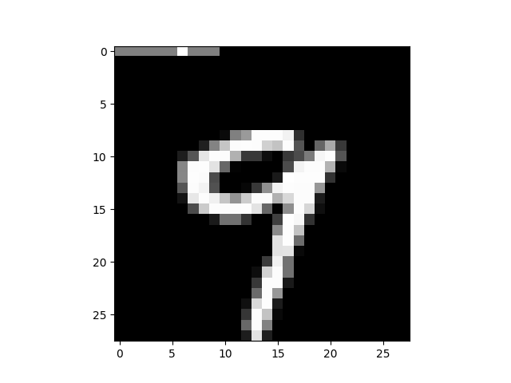
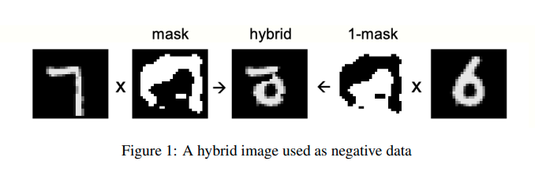
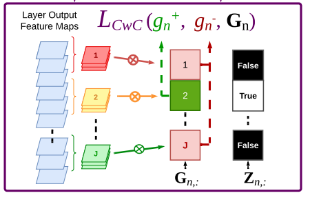
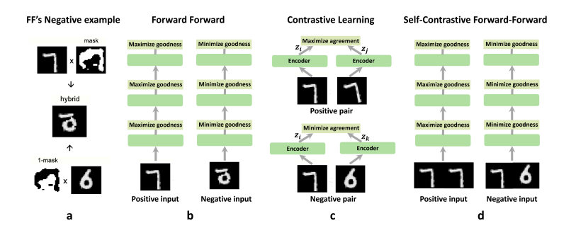

# The Forward-Forward Algorithm: A New Revolution Brought by Geoffrey Hinton  
***At the age of 74, Geoffrey Hinton introduced a new algorithm to replace the backpropagation method—the very technique he popularized in 1986—in an effort to bring deep learning closer to a biologically plausible interpretation. This blog is to show respect for him and discuss my understanding of this work as well as recent developments on this amazing algorithm.***

> And lo, he declared, “Let there be a new way,” and thus the Forward-Forward algorithm was brought forth, that it might supplant the backpropagation he had once bestowed upon the minds of men in the year of 1986. And it was good. ------ *Hinton's Epiphany: A New Era in Deep Learning* (I made this up)

{: .center style="height:300px;"}

## Prerequisite: Problems with the Forward-Backward Method  
Nowadays, most networks utilize Backpropagation __(BP)__ to optimize the network. This is very effective, but its inherent flaws limit the upper bound of its capability. This inspired Hinton and the community to pursue a new method.

### What is the limitation?

1. **First**, BP uses the chain rule to compute derivatives. This requires the forward computational graph to be precise, with no black-box process allowed.

2. **Second**, the ideal way to train a network should be continuous. For example, a robot should learn the rules of the world as it observes, with each frame and movement being directly processed by its brain. This stream of events should flow uninterrupted. It would seem unnatural if the robot had to stop observing every time it received a new frame to perform the BP process.

3. **Last**, and most importantly, BP is not a biologically plausible learning mechanism. In fact, it is highly unlikely that optimization signals are propagated backward through the brain. This suggests that the human brain does not learn using BP. From a practical standpoint, this aligns with common sense. Models like ChatGPT rely on Backpropagation Through Time (BPTT) to adjust their parameters, but this process is clearly unfeasible in the real world—how could a biological system, or any real-world process, literally travel backward through time?

4. Of course, there are many other disadvantages to BP, but understanding that BP is not perfect is enough to continue reading.

## A Brief Introduction to the Forward-Forward Algorithm  
The training process of the Forward-Forward Algorithm can be broken down into two processes: positive learning and negative learning. These two processes are executed in an alternating fashion—first positive learning, then negative learning, then positive again, and then negative... __Goodness__ is defined as the mean square of the output of each layer.

### A. Loss  
During positive learning, we aim to lift up the goodness(output of each layer). The loss is:  
$$ \mathcal{L}_{pos} = \log (1 + \theta - y^2) $$  
where \(y\) is the output of each layer, and \(\theta\) is a hyper-parameter.

During negative learning, we aim to push down the goodness. The loss is:  
$$ \mathcal{L}_{neg} = \log (1 - \theta + y^2) $$

### B. Data  
During positive learning, we input 'fact.' During negative learning, we input 'delusion.'

By 'fact,' we mean the ground truth, while 'delusion' refers to something random or generated by some generative models.

For example, in a simple MNIST dataset classification problem, labels will be mapped to the first 10 pixels on the image. 'Fact' could be the image with the correct label mapping, while 'delusion' would be the image with a random label mapping.

{: .center style="height:300px;"}
{: .center style="height:300px;"}

Another example for unsupervised learning would be 'fact' as the original image and 'delusion' as a combination of two different images.

{: .center style="height:300px;"}

For RNNs and language models, during the positive training period, inputs will be real text data from the dataset. After the positive training period, the model will generate a piece of text data to serve as input for the negative training period.

### C. Inference
During the inference process, the network will concatenate all the goodnesses from each layer, and choose the prediction with the biggest goodness.

### D. Biological Inspiration
One of the fascinating aspects of Biologically Inspired Intelligence is that when we design networks based on biological principles, these networks often display phenomena that can help us better understand brain mechanisms, and FF could be one of them. Hinton pointed out, the training process of FF could be similar to how a infant understand the world. When an infant is awake, they observe the real world, where everything they see is treated as "ground truth"—it's simply what is. Then, when he is asleep, his brain would attempts to replay and make sense of what it has learned. That could be in the form of dreams. In this analogy, the __awake phrase__ would be positive training process, where the brain (or network) absorbs and experiences the world; and the __asleep phrase__ would be negative training process, where the brain refines its understanding by processing and adjusting based on the knowledge it has gathered. 

Indeed, this is a fascinating analogy, but ultimately, it is up to each individual to decide whether they will buy this story.

### E. Limitations
The original paper practiced this method on MLP only, and when I implemented the supervised method on a CNN, it failed, as expected. The label information, treated as marginal data, was lost during the convolution process. Since the only distinction between positive training and negative learning lies in the mapped label information, losing this information would result in a complete failure of the training process. Therefore, to dive deeper into the potential of the FF algorithm, we need to look for better ways to generate negative data.

## Some latest progress on FF algorithm
### A. Training Convolutional Neural Networks with the Forward-Forward Algorithm
This paper proposed an intuitive method for generating negative samples. They defined different labels as 2-D strips matching the size of the image and mapped them onto the images. Unlike the original 1-D one-hot labels, these 2-D labels are not treated as marginal information, meaning they are retained during convolution. As a result, they can be captured by the CNN model, potentially leading to better performance than the vanilla Forward-Forward (FF) algorithm.

However, the results from my experiments indicate that this method may not be as effective on more complex datasets such as CIFAR-10 and CIFAR-100. Please note that the paper does not provide code, and it is possible, although not likely, that my re-implementation on the CIFAR datasets contain errors.

{: .center style="height:300px;"}

### B.Convolutional Channel-wise Competitive Learning for the Forward-Forward Algorithm
This paper re-implemented the FF algorithm, and it changed the way to use label information. Still remember that we want to lift up the output during positive training and push down during negative training? This time, they combined the positive training and negative training. When their model is trained, the output of each layer will be uniformly divide into [num_of_classes] parts, on the channel dimension. Then, the magnitude of the part that aligns with the label will be lifted up, and the other parts will be pushed down. It would be better elaborated in this pseudo code:

    output = layer(input) # dimension = [C, H, W]
    channel_size = output.shape[0] # channel_size = C
    channel_part = torch.split(output, 
    channel_size // num_of_classes, dim = 1) # divide output along the channel dimension

    loss_pos = torch.exp(1 + theta - channel_part[label].pow(2).mean())
    
    loss_net = torch.exp(1 - theta + channel_part[others].pow(2).mean())
This is a very innovative training method to me, and intuitively speaking, it treated every method as a classifier. It could work well on cifar-10 dataset, with an accuracy of 79%.

{: .center style="height:300px;"}

### C. Self-Contrastive Forward-Forward Algorithm
{: .center style="height:300px;"}

I believe this figure could do serve as an introduction. This method involves simply inputting two images and maximizing goodness when two images are the same, and minimizing goodness when they are not the same.

The paper is still in preprint version and no code is provided, and I failed to reimplement their method. So I will make no comment about this idea.

## References
The Forward-Forward Algorithm: Some Preliminary Investigations

Training Convolutional Neural Networks with the Forward-Forward Algorithm

Convolutional Channel-wise Competitive Learning for the Forward-Forward Algorithm

Self-Contrastive Forward-Forward Algorithm

Geoffrey Hinton Unpacks The Forward-Forward Algorithm [Youtube Video at: [URL](https://www.youtube.com/watch?v=NWqy_b1OvwQ&t=1217s)]