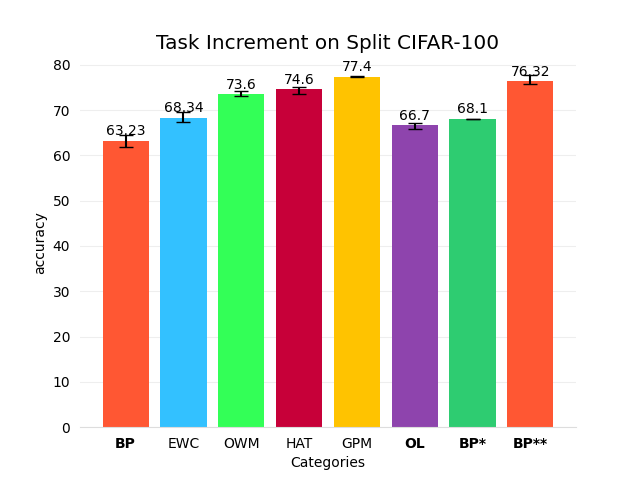

# Feature learning from Continual Learning

> This blog is to document some of the insights of features learning from the view of continual learning. 

**I have always been curious about one thing, what makes neural networks so powerful? One of the subquestions is: what is neural networks learning?**

A very famous example I would like to use is self-attention:

When generating words, the model is concentrating on different parts of the picture, like what we would do.

But are all models learned in this way?

First, we need to remember what the models is doing, it is **Extracting features**, dropping the unneeded information (such as noises), and focus on the valuable content. Then, such valuable content is feed to the last fc layer, which act as a classifier------the layer that learn only the map between features and labels.

## An interesting phenomena

I was enrolled in an AI related course in my school, and one of the project is to do image classification on a dataset collected by ourselves. The dataset is extremely poor, and the data distribution is highly unideal. For example, a tin can can have a label of 'metal', 'waste', or even 'hazardous waste' if it contains outdated medicine.  Let us call it UESTC dataset.

Models seems to be impossible to achieve a good accuracy on such dataset. First, I blame the UESTC dataset for this, and set it aside. Days after, a friend of mine told me that he can achieve a high accuracy of 80% with a pretrained model on image-net. This suddenly draws my attention. By using a simple transfer-learning technique, the model can learn to classify UESTC dataset with high accuracy. Surely, the pretrain experience on ImageNet helped the model to learn how to extract more general information, instead of focusing on minor details that high correlated to a certain dataset.

So naturally, I thought about train the model on the UESTC dataset to better improve its generalization, and then it might perform better on ImageNet. Therefore, I tried, but failed. The model trained on the

Now, I would like to describe this phenomena as feature learning. In fact, I think one of the most important point of transfer learning is feature learning. The teacher model is pretrained on a dataset with high quality, where it learned to extract features, and then it can be transferred to a downstream task with the pretrained parameters as an initialization. This starting point of gradient descent will highly influence the whole process, and most likely it will perform better.

## Continual Learning

However, this method is only for higher accuracy on a specific dataset. Once we started train the model in the downstream task, parameter space will start to shift, and it will lose its generalization. Like this graph:

What if we want this model to learn and **remember**? Is it possible if we let the parameter to stay at the sweet spot, where it can balance the trade-off between performance and over-fit? It is possible, and this problem is called continual learning problem.

Continual learning techniques can alleviate the phenomena of catastrophic forgetting, which means that the model forget about previous tasks when training with latter tasks. 

Another very similar but different concept is called Lifelong learning. This aims to achieve a learning process like human. Learning forever and keep remembering the most important part.

Below, I will briefly introduce some popular continual learning technique.

1. Adding Constrains: such as EWC OWM GPM

   These types of techniques add constrains to the loss function. Constrains could be related to the mean, gradient or variance of parameters. This aims to create a gradient map where the minima is in the sweet spot.

2. Dividing models: such as HAT

   A tricky but unsustainable technique. It divide a model to different parts, and each part is responsible for a certain task. However, this does not suit the goal of lifelong learning, as the model will very soon run out of free space. I also want to emphasize that, short-term continual learning is easy but unimpressive. *📌I will explain why in below*.

3. Memory pool: such as A-GEM

   Such method requires an extra memory pool, used to store previous gradients or data. Under some occasions the model will revisit memory pool and try to "review" about previous knowledge.

## Some imperfections within these techniques

What continual learning attracts me is its motivation, i.e. learning like to understand. To prevent catastrophic forgetting, the ideal way is to learn the general rule of data, without over-concentrated on minor details. Therefore, I believe feature learning is the road to continual learning.

However, these techniques I have presented above does not care about data distillation at all. Nothing about feature extraction, nothing about generalization, but focus on reducing conflict in each training process. It is like a two-edged sword. Perhaps in some scenarios it is better, but at least for their baselines, which is carried out on split-cifar100 or p-mnist, they are a bit less effective. Why would I say so? Because original Backpropagation could do just fine.

**BP* means to load model with highest validation accuracy for each task.**

**BP\** mean to freeze the feature extractor (i.e. the parameters before classifier).**

Does this result shock you? Well, the result is tested on 5 seeds, and they should be enough to mean something. Although BP is highly unstable on continual learning, and in some seeds it could forgetting everything(of course I did not use those seeds for baseline), but some of its transformations achieves impressive accuracy.

Why? How can BP\*\* achieve such a high score? The answer is easy, because fundamentally speaking, BP** is not continual learning. For each task, we are training a single fc layer only, as the previous parameters are frozen. 

📌: That is why I say there is little significant to achieve short-term continual learning, because BP can already do it very well, even better than some techniques such as HAT.

(blog not finished, will update soon)
