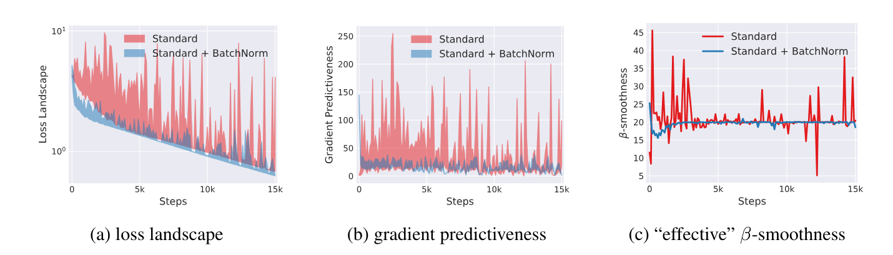
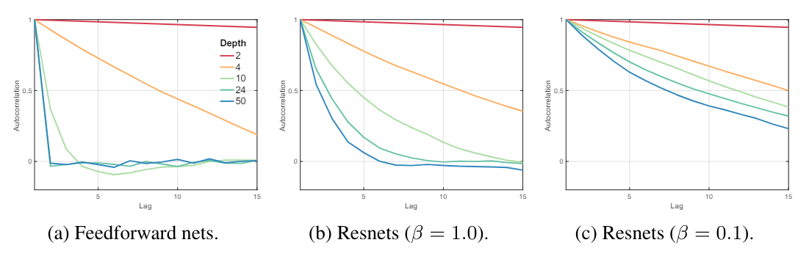

# **My comprehension of Resnet and Batch Norms**

*Skip-connections and rescaling (including normalization) appear in most neural networks. However, some papers use these techniques inappropriately, causing unnecessary network complexity. It is therefore important to revisit the basics for both experimental inspiration and theoretical understanding.*

## **Possible Advantages of Batch Normalization (BN)**

### **Improving Numerical Stability**

Suppose we have a 1-layer linear neural network for a regression problem. The output \(o\) and the Mean Squared Error (MSE) loss \(\mathcal{L}_{MSE}\) are:

$$o = \sigma(w \cdot x)$$  
$$\mathcal{L}_{MSE} = \frac{1}{2}(o - y)^2$$

Through backpropagation, the gradient \(\nabla \mathcal{L}_{w}\) is:

$$\nabla \mathcal{L}_{w} = (o - y) \cdot \frac{\partial o}{\partial (w)} = o \cdot x \cdot \sigma'$$

If the network has \(N\) layers, then the gradient of the first layer would be \(o \cdot \prod_{i=1}^{N} \frac{\partial o}{\partial (w)}\), and the product of this sequence would tend to 0 or infinity. This is **numerical instability**.

With BN, we can restrict \(x\) to any Gaussian distribution, thus mitigating the instability of \(x\) and \(\sigma'\).

### **(Perhaps Not) Alleviating Internal Covariate Shift** [1]

In the original paper on Batch Normalization, they defined Internal Covariate Shift (ICS).

> ICS is the phenomenon where the distribution of inputs to a layer in the network changes due to an update of parameters in previous layers.

Mathematically, each layer can be derived as:

$$Y = \mathcal{F}\{X\}$$

where \(\mathcal{F}\) is the mapping function between input \(X\) and output \(Y\). Essentially, layers are learning this map between input patterns and output patterns. However, due to ICS, the input pattern could constantly change, which might disrupt the learned mapping function. Therefore, ICS is believed to have a detrimental effect on the training process.

However, I propose an alternative understanding of ICS. In traditional machine learning, we assume that data are **IID** (i.e., independently and identically distributed). This is the foundation of machine learning and the prerequisite of **MLE** (i.e., Maximum Likelihood Estimation), which is the original form of all loss functions. By using BN, we can ensure the second **I** in **IID**, which is identically distributed. This could lead to better generalization performance for the network.

_Other researchers, however, have shown that ICS does not affect performance and that BN does not reduce ICS._ They prefer to explain BN’s effectiveness differently.

### **Smoother Loss Landscape** [2]

These researchers demonstrated that BN contributes to a smoother loss landscape, which can be visualized:

With BN, the loss landscape is smoother, which improves training efficiency and allows for a higher learning rate.

### **Better Use of Non-linearity** [3]

Note that there is a linear transformation (i.e., scaling and shifting) applied after the feature map \(x\) is normalized.

{: style="height:300px;"}

Suppose we use the sigmoid function as the activation function.

{: style="height:300px;"}

It’s clear that for \(x \in (-1, 1)\), we have \(\sigma(x) \approx x\). This means the activation function acts almost as an identity transformation, which is not ideal because the purpose of an activation function is to add non-linearity to the model. Therefore, without scaling and shifting, the non-linearity would be weak, making the fitting process difficult.

Even for ReLU, which seems less affected, there are cases where all neurons are either activated \(x > 0\) or deactivated \(x < 0\). If a ReLU neuron is always active, then it is linear; if it’s always inactive, it doesn’t contribute to the network.

From my perspective, however, this might not be BN’s most important contribution. Experiments have shown that placing BN after the activation function can sometimes improve network performance!

## **Possible Advantages of Skip-Connections**

### **Smoother Gradient Flow**

As pointed out in [4], authored by the ResNet creator He, one benefit of skip-connections is smoother gradient flow. For each skip layer, the output can be derived as:

$$\mathbf{x}_{l+1} = \mathbf{x}_l + \mathcal{F}(\mathbf{x}_l, \mathcal{W}_l)$$

And the gradient is:

$$\frac{\partial \mathcal{E}}{\partial \mathbf{x}_l} = \frac{\partial \mathcal{E}}{\partial \mathbf{x}_L} \frac{\partial \mathbf{x}_L}{\partial \mathbf{x}_l} = \frac{\partial \mathcal{E}}{\partial \mathbf{x}_L} \left(1 + \frac{\partial}{\partial \mathbf{x}_l} \sum_{i=l}^{L-1} \mathcal{F}(\mathbf{x}_i, \mathcal{W}_i)\right)$$

With ResNet, the gradient will be a sum of “geometric equations,” preventing it from vanishing.

### **Solving the Network Degradation Problem**

In the original ResNet paper, He claimed that ResNet solved the "network degradation problem." The idea was that if a deeper model performs worse than a shallower one on the test set, it implies that the additional layers in the deeper model are less effective than a straightforward identity mapping. If those extra layers simply acted as identity mappings, the deeper model would match the performance of the shallower model.

With this insight, he designed skip-connections, which are essentially manually added identity mappings.

The real question is, what causes network degradation? Is the degradation problem truly due to a failure to achieve identity mapping? This is an area where researchers differ, and I will present some interesting studies on the topic.

**Gradient Correlation [2]**

Balduzzi et al. [2] proposed a new explanation for network degradation. They first suggested that ResNet alleviates the shattered gradient problem. The shattered gradient problem is defined as follows:

> Shattered gradients undermine the effectiveness of algorithms that assume gradients at nearby points are similar, such as momentum-based and accelerated methods.

Under this assumption, they quantified the shattered gradient problem as the autocorrelation function (ACF). A higher ACF leads to higher performance and a reduced shattered gradient problem. They demonstrated, through both mathematical proofs and experiments, that skip connections enhance ACF. However, their proof relied on very strong assumptions and was not entirely convincing to me.

## **Citation**

[1] Batch Normalization: Accelerating Deep Network Training by Reducing Internal Covariate Shift.  
[2] How Does Batch Normalization Help Optimization?  
[3] The Shattered Gradients Problem: If ResNets Are the Answer, Then What Is the Question?  
[4] Identity Mappings in Deep Residual Networks.
